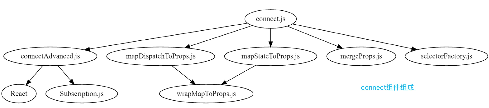

## connnect
`connect` 是一个可以执行两次的柯里化函数，第一次传入的参数相当于一系列的定制化东西，第二次传入的就是你要连接的组件，然后返回一个新的react组件



```javascript
export function createConnect(
  connectHOC = connnectAdvanced,                                          // 高阶函数
  mapStateToPropsFactories = defaultMapStateToPropsFactories,             // mapStateToPropsFactories工厂函数
  mapDispatchToPropsFactories = defaultMapDispatchToPropsFactories,       // mapDiaptchToProps工厂函数
  mergePropsFactories = defaultMergePropsFactories,                       // mergePropsFactories工厂函数
  selectorFactory = defaultSelectorFactory,                               // selector工厂函数，这里解释一下selector的主要作用就是使用上面三个函数，筛选出最后的mergedProps
) {
  return function connect(
    mapStateToProps,
    mapDispatchToProps,
    mergeProps,
    {
      pure = true,
      areStatesEqual = strictEqual,
      areOwnPropsEqual = shallowEqual,
      areStatePropsEqual = shallowEqual,
      areMergedPropsEqual = shallowEqual,
      ...extraOptions
    } = {}
  ) {
    const initMapStateToProps = match(mapStateToProps, mapStateToPropsFactories, 'mapStateToProps')
    const initMapDispatchToProps = match(mapDispatchToProps, mapDispatchToPropsFactories, 'mapDispatchToProps')
    const initMergeProps = match(mergeProps, mergePropsFactories, 'mergeProps')

    return connectHOC(selectorFactory, {
      // used in error messages
      methodName: 'connect',

      // used to compute Connect's displayName from the wrapped component's displayName.
      getDisplayName: name => `Connect(${name})`,

      // if mapStateToProps is falsy, the Connect component doesn't subscribe to store state changes
      shouldHandleStateChanges: Boolean(mapStateToProps),

      // 传给selectorFactory使用
      initMapStateToProps,
      initMapDispatchToProps,
      initMergeProps,
      pure,
      areStatesEqual,
      areOwnPropsEqual,
      areStatePropsEqual,
      areMergedPropsEqual,

      // any extra options args can override defaults of connect or connectAdvanced
      ...extraOptions
    })
  }
}
```

可以看到其中使用到了`strictEqual` 和 `shallowEqual` 进行比较，代码如下:
```javascript
// strictEqual
function strictEqual(a, b) { return a === b }

// shallowEqual
const hasOwn = Object.prototype.hasOwnProperty

function is(x, y) {
  if (x === y) {
    return x !== 0 || y !== 0 || 1 / x === 1 / y
  } else {
    return x !== x && y !== y
  }
}

export default function shallowEqual(obj1, obj2) {
  if (is(obj1, obj2)) return true

  if (typeof objA !== 'object' || objA === null || typeof objB !== 'object' || objB === null) {
    return false
  }

  const keysA = Object.keys(objA)
  const keysB = Object.keys(objB)

  if (keysA.length !== keysB.length) return false

  for (let i = 0; i < keysA.length; i++) {
    if (!hasOwn.call(objB, keysA[i]) || !is(objA[keysA[i]], objB[keysA[i]])) {
      return false
    }
  }

  return true
}
```

里面还用到了`match`函数来对`mapStateToProps, mapDispatchToProps, mergeProps`进行初始化判断:
```javascript
function match(arg, factories, name) {
  for (let i = factories.length - 1; i >= 0; i--) {
    const result = factories[i](arg)
    if (result) return result
  }

  return (dispatch, options) => {
    throw new Error(`Invalid value of type ${typeof arg} for ${name} argument when connecting component ${options.wrappedComponentName}.`)
  }
}
```

## connectHOC
`connectHOC`是一个高阶函数，

```javascript
function makeSelectorStateful(sourceSelector, store) {
  // wrap the selector in an object that tracks its results between runs.
  const selector = {
    run: function runComponentSelector(props) {
      try {
        const nextProps = sourceSelector(store.getState(), props)
        if (nextProps !== selector.props || selector.error) {
          selector.shouldComponentUpdate = true
          selector.props = nextProps
          selector.error = null
        }
      } catch (error) {
        selector.shouldComponentUpdate = true
        selector.error = error
      }
    }
  }

  return selector
}

export default function connectAdvanced(
  /**
    selectorFactory是一个函数，其返回一个selector函数，用来从state、props、dispatch中计算新的props，最后注入组件

    export default connectAdvanced((dispatch, options) => (state, props) => ({
      thing: state.things[props.thingId],
      saveThing: fields => dispatch(actionCreators.saveThing(props.thingId, fields)),
    }))(YourComponent)
  */
  selectorFactory,
  // options obj
  {
    getDisplayName = name => `ConnectAdvanced(${name})`,
    methodName = 'connectAdvanced',
    renderCountProp = undefined,
    shouldHandleStateChanges = true,
    storeKey = 'store',
    withRef = false,
    ...connectOptions
  } = {}
) {
  const subscriptionKey = storeKey + 'Subscription'
  const version = hotReloadingVersion++

  const contextTypes = {
    [storeKey]: storeShape,
    [subscriptionKey]: subscriptionShape,
  }
  const childContextTypes = {
    [subscriptionKey]: subscriptionShape,
  }

  return function wrapWithConnect(WrappedComponent) {
    const wrappedComponentName = WrappedComponent.displayName || WrappedComponent.name || 'Component'
    const displayName = getDisplayName(wrappedComponentName)

    const selectorFactoryOptions = {
      ...connectOptions,
      getDisplayName,
      methodName,
      renderCountProp,
      shouldHandleStateChanges,
      storeKey,
      withRef,
      displayName,
      wrappedComponentName,
      WrappedComponent
    }

    class Connect extends Component {
      constructor(props, context) {
        super(props, context)

        this.version = version
        this.state = {}
        this.renderCount = 0
        this.store = props[storeKey] || context[storeKey]
        this.propsMode = Boolean(props[storeKey])               // 判断store是否来自props
        this.setWrappedInstance = this.setWrappedInstance.bind(this)

        this.initSelector()         // 初始化Selector
        this.initSubscription()     // 初始化监听
      }

      getChildContext() {
        // 如果store是通过props中传入，则不加入subscription订阅链
        const subscription = this.propsMode ? null : this.subscription

        // 将当前组件实例挂载subscription，添加到context中，以供子组件读取
        return { [subscriptionKey]: subscription || this.context[subscriptionKey] }
      }

      componentDidMount() {
        if (!shouldHandleStateChanges) return


        // 放在componentDidMount 而不是componentWillMount是为了照顾SSR(不会执行componentWillMount)
        // 可能在componentWillMount中就dispatch了一个action，修改了state，那么可能就监听不到了，所以下面会再次执行一遍selector.run方法，保证渲染的准确性
        this.subscription.trySubscribe()
        this.selector.run(this.props)
        if (this.selector.shouldComponentUpdate) this.forceUpdate()
      }

      componentWillReceiveProps(nextProps) {
        this.selector.run(nextProps)
      }

      shouldComponentUpdate() {
        return this.selector.shouldComponentUpdate
      }

      componentWillUnmount() {
        if (this.subscription) this.subscription.tryUnsubscribe()
        this.subscription = null
        this.notifyNestedSubs = noop
        this.store = null
        this.selector.run = noop
        this.selector.shouldComponentUpdate = false
      }

      getWrappedInstance() {
        return this.wrappedInstance
      }

      setWrappedInstance(ref) {
        this.wrappedInstance = ref
      }

      initSelector() {
        // 将将dispatch和那些mapToProps方法传入
        const sourceSelector = selectorFactory(this.store.dispatch, selectorFactoryOptions)
        // 暴露一个run方法供调用，缓存每次的计算结果
        this.selector = makeSelectorStateful(sourceSelector, this.store)
        // 第一次调用，进行一些初始化操作，此时不会执行各个equals方法
        this.selector.run(this.props)
      }

      initSubscription() {
        // 不需要订阅就返回
        if (!shouldHandleStateChanges) return

        // 获取父组件的subscription对象
        const parentSub = (this.propsMode ? this.props : this.context)[subscriptionKey]
        this.subscription = new Subscription(this.store, parentSub, this.onStateChange.bind(this))

        this.notifyNestedSubs = this.subscription.notifyNestedSubs.bind(this.subscription)
      }

      // 每次state发生时，被触发的函数
      onStateChange() {
        this.selector.run(this.props)

        if (!this.selector.shouldComponentUpdate) {
          // 如果本次组件自身不更新，通知子组件更新
          this.notifyNestedSubs()
        } else {
          // 如果本次组件需要更新，则在更新完成后（didUpdate），通知子组件更新
          // 如果本次re-render，同时触发了子组件的re-render，那么即便通知更新，子组件也不会重绘了
          this.componentDidUpdate = this.notifyNestedSubsOnComponentDidUpdate
          // 同时调用setState触发组件更新, dummyState={}
          this.setState(dummyState)
        }
      }

      notifyNestedSubsOnComponentDidUpdate() {
        this.componentDidUpdate = undefined
        this.notifyNestedSubs()
      }

      isSubscribed() {
        return Boolean(this.subscription) && this.subscription.isSubscribed()
      }

      addExtraProps(props) {
        if (!withRef && !renderCountProp && !(this.propsMode && this.subscription)) return props
        const withExtras = { ...props }
        if (withRef) withExtras.ref = this.setWrappedInstance
        if (renderCountProp) withExtras[renderCountProp] = this.renderCount++
        if (this.propsMode && this.subscription) withExtras[subscriptionKey] = this.subscription
        return withExtras
      }

      render() {
        const selector = this.selector
        selector.shouldComponentUpdate = false

        if (selector.error) {
          throw selector.error
        } else {
          return createElement(WrappedComponent, this.addExtraProps(selector.props))
        }
      }
    }

    Connect.WrappedComponent = WrappedComponent
    Connect.displayName = displayName
    Connect.childContextTypes = childContextTypes
    Connect.contextTypes = contextTypes
    Connect.propTypes = contextTypes

    if (process.env.NODE_ENV !== 'production') {
      Connect.prototype.componentWillUpdate = function componentWillUpdate() {
        if (this.version !== version) {
          this.version = version
          this.initSelector()

          let oldListeners = [];

          if (this.subscription) {
            oldListeners = this.subscription.listeners.get()
            this.subscription.tryUnsubscribe()
          }
          this.initSubscription()
          if (shouldHandleStateChanges) {
            this.subscription.trySubscribe()
            oldListeners.forEach(listener => this.subscription.listeners.subscribe(listener))
          }
        }
      }
    }

    // 将子组件的非React的静态属性或方法复制到父组件，React相关属性或方法不会被覆盖而是合并
    return hoistStatics(Connect, WrappedComponent)
  }
}
```
